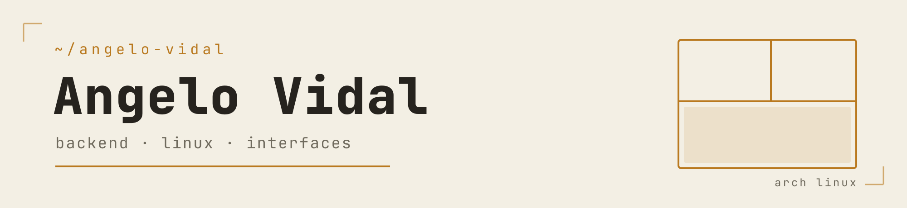

<picture>
  <source media="(prefers-color-scheme: dark)" srcset="./assets/banner-dark.png">
  
</picture>

### Sobre mí

Estudiante de programación en Chile. Me mueve el **backend** —Python,
Django, bases de datos— y las **interfaces** bien hechas: tipografía, espaciado y
que nada sobre. Fuera de clases mantengo mi propio entorno de escritorio en Arch,
**Hyprland + Quickshell + Waybar**, escrito y ajustado a mano.

### Sistema

```text
angelo@github
──────────────────────────────
 distro    Arch Linux
 wm        Hyprland · Quickshell
 shell     fish
 editor    VS Code · Mousepad
 estudia   Django · Backend
 arma      escritorios · Minecraft
```

### Stack

**Lenguajes**


**Frameworks y herramientas**


### Proyectos

| Repo | Qué es |
|------|--------|
| [`inventario-minimarket`](https://github.com/Angelo-Vidal/inventario-minimarket) | SPA en React + Vite: control de inventario para un minimarket (evaluación Frontend) |
| [`quemchi`](https://github.com/Angelo-Vidal/quemchi) | Maqueta de sitio para una página municipal |
| [`internet-oscura`](https://github.com/Angelo-Vidal/internet-oscura) | Documental educativo |
| `dotfiles` | Mi configuración de Hyprland / Quickshell · *privado* |

### Estadísticas

<picture>
  
</picture>

<picture>
  
</picture>

<br clear="left" />

---

<sub>Chile · <a href="https://github.com/Angelo-Vidal?tab=repositories">todos los repositorios</a></sub>
